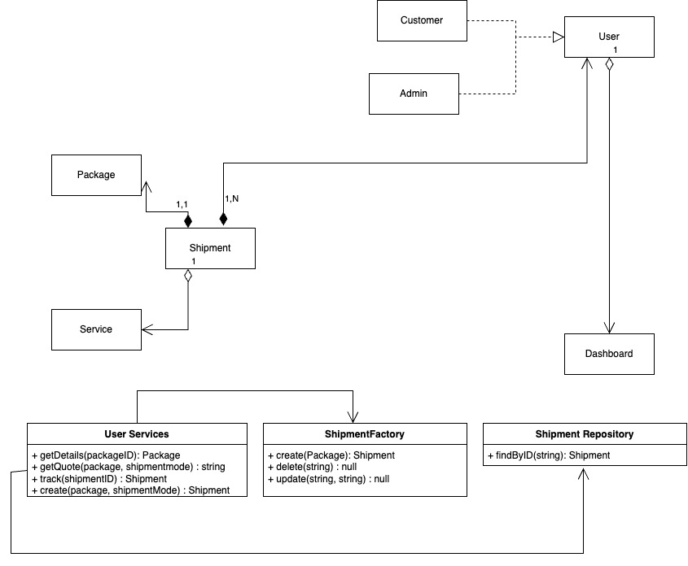
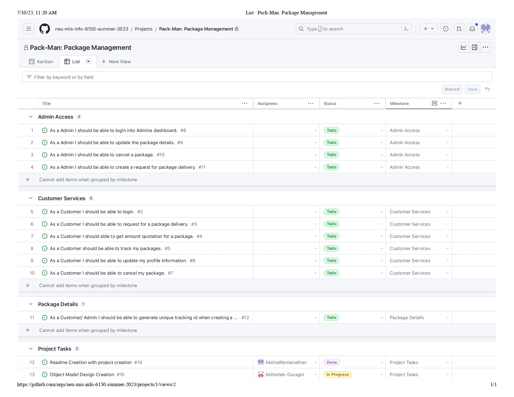

# Pack-Man: Package Management

An application for users to create shipments, track their packages.
In this applications the users have a dashboard to login into where they can create and add details of their packages, based on which get quotations for the shipment they want to create. The price is generated based on the dimensions of the package and the distance to destination. The customers can also manage and track their package once they create the shipment.
The application also provides an Admin dashboard where the admins can change the status of the shipments and manage the package details (request foer delivery, cancel, generate tracking ID, etc.)

## Types of Services Available

- Ground: Shipment by Road - more feasable option
- Express: Shipment by Air - expensive but faster option

## Object Model

- User
  - userName: String
  - email: String
  - address: String
  - password: SHA256(String)
  - userType: Enum: `CUSTOMER`, `ADMIN`
- Shipment
  - package: Package
  - cost: float
  - duration: float
  - trackingId: UUID
  - status: Enum :`CREATED`, `PICKED_UP`, `IN_TRANSIT`, `CANCELLED, DELIVERED`
  - serviceType: Enum: `GROUND`, `EXPRESS`
- Package
  - from: User
  - toName: String
  - toAddress: String
  - dimension: object
    - length: float
    - breadth: float
    - height: float
  - packageType: Enum: `DOCUMENT`, `DAIRY_GOODS`, `PERSONAL_ITEMS`, `BOX`, `ENVELOPE`, `FOOD_ITEMS`
- Dashboard
  - type: Enum: `AdminDashboard`, `CustomerDashboard`
- ShipmentRepository
  - shipment `GET`
- ShipmentFactory
  - Shipment, Package `CRUD`
- UserService
  - shipment `GET`, `POST`
  - quotation `GET`
  - tracking: `GET`

### Domain Design Object Model Diagram

## Rest API Resources Identified (at present)

- Cutomer Services
  - `POST` /api/login - For customer Login
  - `POST` /api/user/registration - For customer registration (userType - admin or customer)
  - `POST` /api/shipment/create - For shipment creation
  - `GET` /api/shipment/getquote/ - To get quotation for a shipment
  - `GET` /api/shipment/{shipmentId} - To get tracking details of shipment
  - `PUT` /api/customer/update - To update profile information
- Admin Access
  - `POST` /api/login - For admin Login
  - `PUT` /api/shipment/{shipmentId} - To update shipment information
  - `DELETE` /api/shipment/{shipmentId} - To delete/cancel a shipment delivery request
  - `PUT` /api/shipment/changestatus/{shipmentId} - To change status of shipment

## Feature based User Stories

- Admin Access Milestone:
  - As a Admin, I should be able to login into Admins dashboard
  - As a Admin, I should be able to update the package details
  - As a Admin, I should be able to cancel a package
  - As a Admin, I should be able to create a request for package delivery
- Customer Services Milestone:
  - As a Customer, I should be able to login
  - As a Customer, I should be able to request for a package delivery
  - As a Customer, I should able to get amount quotation for a package
  - As a Customer, should be able to track my packages
  - As a Customer, I should be able to update my profile information
  - As a Customer, I should  be able to cancel my package
- Package Specific Milestone:
  - As a Customer/ Admin I should be able to generate unique tracking id when creating a order for package delivery
- Remaining user stories/tasks/issues can be seen in issues tab and [Project Kanban Board](https://github.com/orgs/neu-mis-info-6150-summer-2023/projects/1/views/1) linked with this repo

